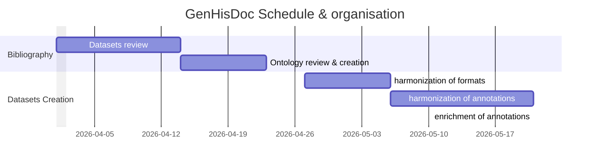
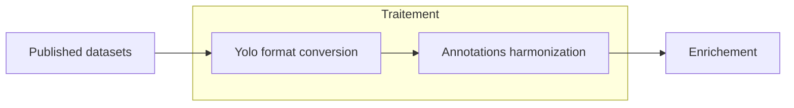

# GenHisDoc 

GenHisDoc is a generalistic datasets for historical documents layout recognition and detection. GenHisDoc use a combination of several previously published datasets which have been adapted and re-annotated to work together and our own annotated data.

```markdown
GenHisDoc
├── code 
├── S-VED
├── illuhisdoc
├── Horae LS_V2
└── Custom (Lujes) 
```
## Project schedule and organisation



## Pipeline



## Published Datasets inside GenHisDoc

### The Sacrobosco Dataset (S-VED)
Paper : [CorDeep and the Sacrobosco Dataset: Detection of Visual Elements in Historical Documents](https://doi.org/10.3390/jimaging8100285)

Published by Jochen Büttner 1, Julius Martinetz 1,2, Hassan El-Hajj 1,2, Matteo Valleriani 1,2,3,4.

1 : Max Planck Institute for the History of Science, Boltzmannstr. 22, 14195 Berlin, Germany

2 : BIFOLD—Berlin Institute for the Foundations of Learning and Data, 10587 Berlin, Germany

3 : Institute of History and Philosophy of Science, Technology, and Literature, Faculty I—Humanities and Educational Sciences, Technische Universität Berlin, Straße des 17. Juni 135, 10623 Berlin, Germany

4 : The Cohn Institute for the History and Philosophy of Science and Ideas, Faculty of Humanities, Tel Aviv University, P.O. Box 39040, Ramat Aviv, Tel Aviv 6139001, Israel

Datasets : [The Sacrobosco Dataset](https://zenodo.org/record/7142456)

Modifications : The printer's mark annotation classe has been transfered to the illustration annotation classe. The format of the annotation in csv as been transformed into yolo style format with a txt attached to the image.

### IlluHisDoc

Paper : [docExtractor: An off-the-shelf historical document element extraction](https://arxiv.org/abs/2012.08191)

Published by Tom Monnier 1 et Mathieu Aubry 1

1 : LIGM, École nationale des Ponts et chaussées, Université Gustave Eiffel, CNRS, Marne-la-vallée, France

Datasets: [Illuhisdoc dropbox link](https://www.dropbox.com/scl/fi/ql0yxqapyyl0adbzzgn1x/illuhisdoc.zip?rlkey=q7mqkd3ljzwrk3lelkm2rgico&e=1&dl=0)

Modifications : Illuhisdoc use a per pixel segmentation with 4 classes, we transformed this segmentation in yolo style format detection.

### Horae LSv2

Datasets : [HORAE-LSv2. Layout Segmentation Dataset for Medieval Books of Hours (Version 2)](https://zenodo.org/records/16919911)

Published by Stutzmann Dominique 1, Bernard Leterme Lise 1, Boillet Mélodie 2, Bonhomme Marie-Laurence, Kermorvant Christopher 3

1 :  Institut de recherche et d'histoire des textes du Centre national de la recherche scientifique, Paris - Aubervilliers, 14, cours des Humanités, 93322 Aubervilliers

2 & 3 : Teklia, 30 rue Raymond Losserand, 75014 Paris, France

Modificatons : Horae use a deep annotation system usefull only for manuscript, we reunited this classes into our segmentation ontology. We kept 4244 annotations about ornements, illustrations and initials, and suppressed 18720 annotations about text segmentation.

### Aikon / Projet VHS / Eida 

[Aikon](https://aikon-platform.github.io/) is a IIIF automatic annotation project financed by the ERC project DISCOVER and developped between the [IMAGINE-LIGM laboratory at École nationale des ponts et chaussées](https://imagine-lab.enpc.fr/), [LTE laboratory at Observatoire de Paris-PSL](https://lte.observatoiredeparis.psl.eu/). Aikon is not a dataset, we aggregated and formated the open and human corrected annotated witness by the community in the Project VHS and Eida environnement of Aikon.

#### Projet VHS

 [VHS](https://vhs.hypotheses.org/) is an interdisciplinary research project bringing together specialists in History of Science and Computer Vision to develop a new approach in the historical analysis of the circulation of scientific knowledge and the development of a visual scientific thought from the Middle Ages to the modern era, based on new methods of illustration analysis. 

 

Witness #2320 : Cyclopaedia, 5e éd., Vol. 2 - annotated by Alexandre

Witness #2365 : Latin 7416 | Paris, BnF - annotated by Alexandre

Witness #2377 : Cod. 44 | Österreichische Nationalbibliothek - annotated by Alexandre

Witness #2416 : Lat. Q. 9 | Universiteitsbibliotheek - annotated by Alexandre

Witness #2418 : Voss. Lat. Q. 40 | Universiteitsbibliotheek - annotated by Alexandre

Witness #2420 : 187 | Wien, Österreichische Nationalbibliothek - annotated by Alexandre

Witness #2421 : T. 47 | Biblioteca Ambrosiana - annotated by Alexandre

Witness #2387 : Latin 13955 | Paris, BnF - annotated by Alexandre 

Witness #2423 : Dc 183 | Dresden, Sächsische Landesbibliothek - annotated by Alexandre 
